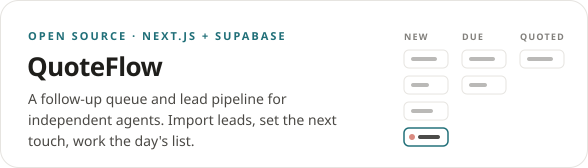

<picture>
  <source media="(prefers-color-scheme: dark)" srcset="assets/hero-dark.svg">
  
</picture>

Product lead turned full-stack builder, in Miami. I spent eight years inside an insurance agency running Salesforce, data and product for a few thousand agents, and got tired of software built for somebody else's day. So now I build the kind agents actually open: the CRM, the dialer, the texting, the pipeline, the compliance paperwork.

### Building

  <a href="https://navocrm.com"><picture>
    <source media="(prefers-color-scheme: dark)" srcset="assets/card-navo-dark.svg">
    
  </picture></a>
  <a href="https://github.com/mybaditssam/quoteflow"><picture>
    <source media="(prefers-color-scheme: dark)" srcset="assets/card-quoteflow-dark.svg">
    
  </picture></a>

### Stack

<picture>
  <source media="(prefers-color-scheme: dark)" srcset="assets/stack-dark.svg">
  
</picture>

Teal is what I build with now. Coral is the enterprise years, and they still pay rent: most of what I know about data models and compliance came from them.

### Elsewhere

[LinkedIn](https://www.linkedin.com/in/samuel-hernandez-649567130/) · [X](https://x.com/mybaditsnotsam) · [Portfolio](https://mybaditssam.github.io/mybaditssam/) · [Navo](https://navocrm.com)

The one waving is Orbi. He lives in Navo and turns up wherever a screen would otherwise be empty.
